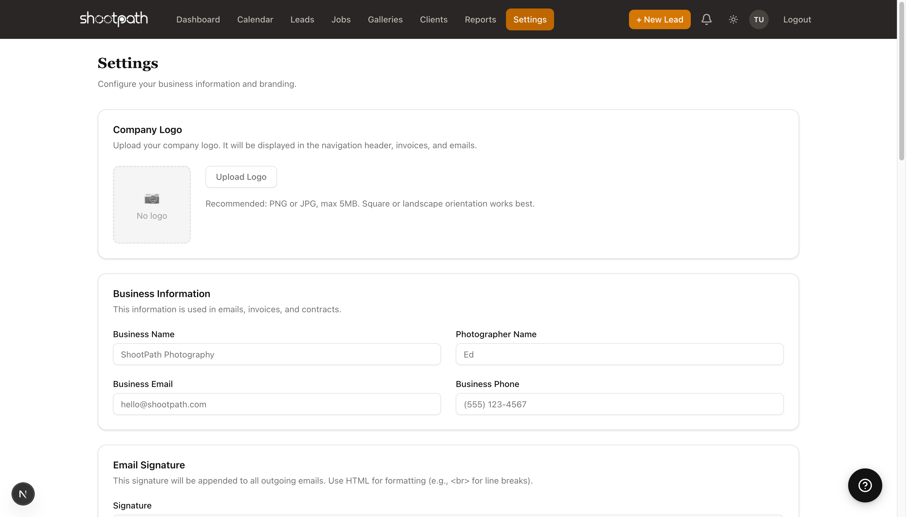

# Basic Settings

## Quick Reference

Before you start using ShootPath, you'll want to configure a few essential settings so your business info appears correctly in emails, invoices, and contracts.

**Critical Settings to Configure First:**

1. **Business Information** - Your business name, email, and phone
2. **Photographer Name** - How you sign your emails
3. **Email Signature** - Appears at the bottom of all outgoing emails
4. **Business Logo** (optional but recommended)



**Where to Find Settings:**
Click **"Settings"** in the left sidebar navigation.

**What You Can Skip For Now:**
- Packages & Add-ons (set these up when you're ready to send your first quote)
- Payment schedules (configure when needed)
- Advanced integrations (Stripe, email, etc.)
- Workflow customization

**Quick Setup Time:** About 5-10 minutes to get the essentials configured.

**Next Steps:** Once your basic info is set, head back to the [Dashboard](./) and [create your first lead](./creating-a-lead)!

---

## Detailed Guide

### Why Settings Matter

The information you configure in Settings gets used throughout ShootPath:

- **Emails to clients** - Your business name and signature appear in every email
- **Invoices and contracts** - Your business info and logo appear on official documents
- **Client portal** - Clients see your branding when they view quotes and galleries
- **Your profile** - How your business appears to clients

Taking 10 minutes to set this up now means every client interaction looks professional and polished!

### Accessing Settings

From anywhere in ShootPath:
1. Look for **"Settings"** in the left sidebar navigation
2. Click it
3. You'll land on the main Settings page with your business information

### Business Information

This section contains the core details about your photography business.

#### Business Name

Enter your business name exactly as you want it to appear on invoices, contracts, and emails.

**Examples:**
- "Sarah Johnson Photography"
- "Willow Creek Studios"
- "J&M Wedding Photography"

**Why it matters:** This appears on every official document and email your clients receive. Make sure it matches your branding!

#### Photographer Name

This is YOUR name - the person behind the camera. It's used in email signatures and anywhere ShootPath needs to personalize communication.

**Examples:**
- "Sarah Johnson"
- "Jamie and Morgan"
- "Alex Rivera"

**Tip:** If you're a team, you can put both names here!

#### Business Email

The primary email address for your business. This is where:
- Client replies will go
- System notifications are sent
- Your "from" address for outgoing emails (if you haven't set up SMTP)

**Use a professional email:**
- ✅ sarah@sarahjohnsonphoto.com
- ✅ hello@willowcreekstudios.com
- ❌ sarahjohnson1987@gmail.com (works, but looks less professional)

**Important:** Make sure you have access to this email! You'll receive important notifications here.

#### Business Phone

Your contact phone number. Appears on invoices and contracts so clients can reach you.

**Format:** Enter it however you prefer:
- (555) 123-4567
- 555-123-4567
- +1 555 123 4567

### Email Signature

Your email signature appears at the bottom of every email ShootPath sends on your behalf. This is your chance to add a personal touch!

**What to include:**
- Your name
- Your business name
- Contact info (phone, website, social media)
- A friendly sign-off

**Example:**
```
Best,
Sarah Johnson
Sarah Johnson Photography
www.sarahjohnsonphoto.com
Instagram: @sarahjphoto
(555) 123-4567
```

**Another example:**
```
Looking forward to working with you!

- Jamie & Morgan
Willow Creek Studios
hello@willowcreekstudios.com
```

The signature editor supports basic formatting - use the toolbar to add **bold**, *italic*, links, and line breaks.

:::tip Pro Tip
Keep it concise! A 3-4 line signature is perfect. Too much info can feel overwhelming.
:::

### Company Logo

Upload your logo to make your brand shine! Your logo appears:
- In the navigation header (when you're using ShootPath)
- On invoices and contracts
- In email headers (if you have custom branding enabled)

**How to upload:**
1. Click **"Upload Logo"**
2. Select a PNG or JPG file (max 5MB)
3. The logo will upload and display immediately

**Logo guidelines:**
- **Format:** PNG (with transparent background) works best
- **Size:** Square or landscape orientation
- **Resolution:** High-res for print documents (at least 500px wide)
- **File size:** Keep it under 5MB

**Don't have a logo?** No worries! ShootPath works great without one. You can always add it later when you're ready.

### What You Can Configure Later

Settings has a lot of options, but you don't need to configure everything right away! Here's what you can skip for now:

#### Packages & Add-ons

This is where you'll set up your photography packages and optional add-ons. Skip it until you're ready to send your first quote - you can configure it then!

**Examples of packages:**
- Wedding: Full Day Coverage ($3,500)
- Portrait: Family Session ($350)
- Event: Hourly Rate ($200/hr)

**Examples of add-ons:**
- Extra hour of coverage (+$200)
- Engagement session (+$400)
- Photo album (+$500)

#### Payment Schedules

Configure how you split payments (50/50, retainer + balance, etc.). You'll set these up when creating your first quote.

#### Job Types

ShootPath comes with common job types (Wedding, Portrait, Event, Commercial), but you can add custom ones if you specialize in something specific:
- Newborn Photography
- Real Estate
- Corporate Headshots
- Pet Photography

#### Templates

Customize your email templates, contracts, and questionnaires. The defaults work great to start, but you can personalize them as you go!

#### Integrations

Connect Stripe for payments, Gmail for emails, and other services. These are optional and can be set up when you're ready.

### User Profile Settings

In addition to business settings, you can configure your personal user profile:

**Access it from:** Settings > User Profile

**What you can set:**
- **Display Name** - How your name appears in the interface
- **Password** - Change your login password
- **Personal Email Signature** - Different from business signature if needed

### Theme Preference

At the bottom of the Settings page, you can choose your theme:
- **Light** - Bright interface
- **Dark** - Easy on the eyes in low light
- **System** - Automatically matches your device preference

This only affects how YOU see ShootPath - it doesn't change anything for your clients!

### Quick Setup Checklist

Here's a simple checklist to get you started:

- [ ] **Business Name** - Set your photography business name
- [ ] **Photographer Name** - Add your name
- [ ] **Business Email** - Set your primary contact email
- [ ] **Business Phone** - Add your phone number
- [ ] **Email Signature** - Create a friendly signature
- [ ] **Logo** (optional) - Upload your logo if you have one

**Time required:** 5-10 minutes

**After setup:** You're ready to start using ShootPath!

### Testing Your Settings

Want to make sure everything looks right? Here's how to test:

1. **Create a test lead** - Make a fake client inquiry
2. **Send yourself a quote** - Use your own email as the client
3. **Review how it looks** - Check that your business name, logo, and signature appear correctly
4. **Adjust if needed** - Go back to Settings and tweak anything that doesn't look right

### Tips for Professional Setup

**Be consistent** - Use the same business name, email, and branding everywhere (website, social media, ShootPath)

**Keep it current** - If you change your phone number or email, update it here immediately

**Test everything** - Send yourself a test email or quote to see how clients will experience your branding

**Don't overthink it** - Simple, clean information is better than trying to be overly fancy. Focus on clarity!

### Common Questions

**Do I need a business email?**
No, you can use a personal email like Gmail. But a custom domain email (you@yourbusiness.com) looks more professional!

**Can I change these settings later?**
Yes! You can update your business info, signature, and logo anytime. Changes apply to new emails and documents going forward.

**What if I don't have a logo?**
No problem! ShootPath works great without a logo. You can always add one later as your business grows.

**Can I have multiple users?**
Yes! ShootPath supports team accounts. Each team member can have their own login and personal settings.

### What's Next?

Now that your business info is configured, you're ready to start using ShootPath!

**Get started with your first client:**
1. [Go to your Dashboard](./) to see your overview
2. [Create your first lead](./creating-a-lead) to track a client inquiry
3. Send a quote with your packages and pricing
4. Book your first job! 🎉

**Want to dive deeper?**
- Set up your [photography packages](#)
- Customize your [email templates](#)
- Configure [workflows for each job type](#)

---

**Questions?** Look for the help links throughout ShootPath, or reach out to support if you need help!
