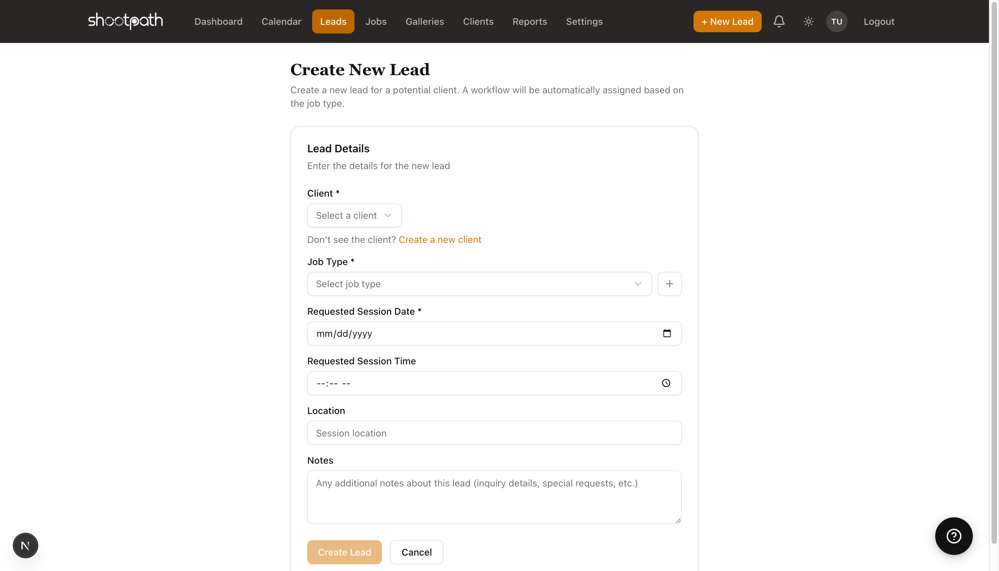
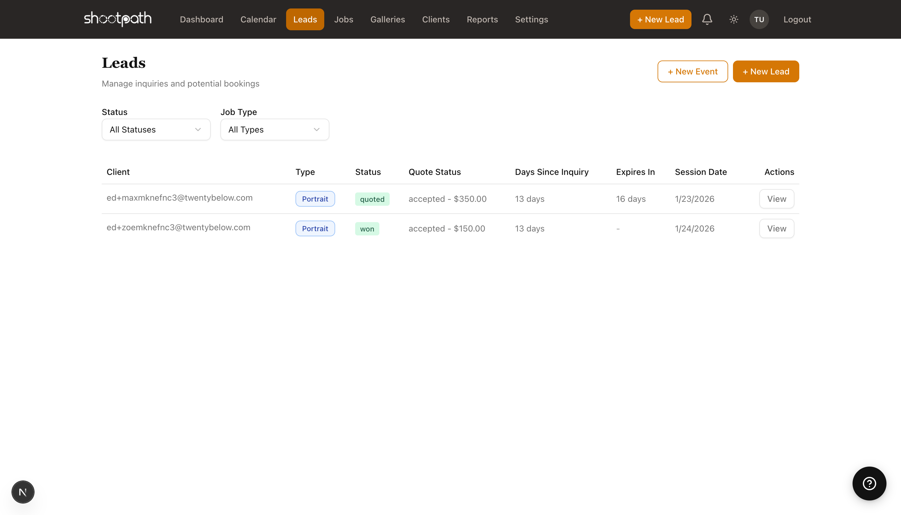

# Creating Your First Lead

## Quick Reference

A lead is a potential client who's interested in your photography services. Every client relationship in ShootPath starts here!

**How to Create a Lead:**

1. Click **"+ New Lead"** in the top-right navigation
2. Select an existing client or create a new one
3. Choose the job type (Wedding, Portrait, Event, etc.)
4. Enter the requested session date
5. Add any notes from your conversation
6. Click **"Create Lead"**

**What Happens Next:**
- The lead appears in your leads list
- You can send them a quote with pricing
- ShootPath tracks how long the lead has been pending
- Once they book, the lead converts to a job

**Next Steps:** After creating a lead, you'll typically want to send them a quote with your pricing and packages.

---

## Detailed Guide

### What is a Lead?

Think of a lead as the beginning of your client journey. Someone fills out your contact form saying "I'm interested in family portraits" - that's a lead! Or maybe a friend refers someone to you - that's a lead too.

In ShootPath, leads help you:
- Keep track of everyone who's inquired about your services
- Remember what they're looking for and when they need it
- Track how long it's been since they reached out (so you don't forget to follow up!)
- Send professional quotes and manage the booking process

### When to Create a Lead

Create a new lead whenever:
- Someone fills out your contact form
- You get an inquiry via email, Instagram DM, or phone
- A past client refers someone to you
- You meet a potential client at a wedding or event
- Anyone expresses interest in booking you

**Don't worry about creating too many leads!** It's better to track every inquiry than to lose potential bookings because you forgot to follow up.

### Creating Your First Lead

Let's walk through the process step by step.

#### Step 1: Click "+ New Lead"

You'll find this button in two places:
- Top-right navigation (always visible)
- On the Leads page itself

Both do the same thing - pick whichever is more convenient!

#### Step 2: Select or Create a Client

The first field asks you to select a client. If this is someone brand new (which it usually is for leads), you'll need to create their client record first.

**To create a new client:**
1. Click the **"Create a new client"** link below the client dropdown
2. Fill in their name, email, and phone number
3. Add their address if you have it (useful for location-based shoots)
4. Click "Create Client"
5. You'll be brought back to the lead creation form with your new client selected

:::tip Pro Tip
The client record is where ShootPath stores all their contact info. Once you create it, you can reuse it for future inquiries or bookings from the same person!
:::

#### Step 3: Choose the Job Type

Select what kind of photography session they're interested in:
- **Wedding** - Full wedding coverage or elopements
- **Portrait** - Family, senior, headshot, or couple portraits
- **Event** - Birthday parties, corporate events, conferences
- **Commercial** - Product photography, real estate, branding
- Or any custom job types you've created in Settings

**Why this matters:** The job type determines which workflow ShootPath uses to guide you through the booking process. Weddings might need multiple timelines and vendor questionnaires, while portraits might have a simpler workflow.

#### Step 4: Enter the Session Date

When does your client want their photoshoot? Enter the date they requested (or your best guess if they said "sometime in June").

**Don't stress about getting it perfect** - you can always change this later! Many clients don't have a firm date when they first inquire. Just put your best estimate.

You can also add a specific time if they mentioned "we're thinking around 3pm for golden hour."

#### Step 5: Add Notes

This is your space to capture anything important from your initial conversation:
- "Wants outdoor location with natural light"
- "Budget around $500"
- "Referred by Sarah Johnson"
- "Mentioned they have 3 kids under 5"
- "Need photos by October 15th for holiday cards"

**Why notes are helpful:** When you're looking at this lead a week from now, these notes will remind you exactly what the client wanted. Plus, referencing these details in your follow-up email shows you were really listening!

### After Creating the Lead

Once you click "Create Lead," a few things happen automatically:

1. **The lead appears in your leads list** where you can see all your inquiries at a glance
2. **ShootPath starts tracking how long it's been pending** so you know who needs a follow-up
3. **You can now send a quote** with your pricing and packages
4. **The lead shows up in your dashboard metrics** under "Active Leads"

### Next Steps: Sending a Quote

After creating a lead, you'll typically want to send them pricing. From the lead detail page, you can:

1. Click **"Create Quote"**
2. Select your packages and add-ons
3. Set up a payment schedule (deposit + balance)
4. Preview how it looks
5. Send it to your client

The client receives a beautiful, professional quote they can review and accept online. Once they accept, ShootPath automatically creates a job and moves them through your workflow!

### Finding Your Leads Later

All your leads live in the **Leads** section (in the sidebar navigation). You can:
- Filter by status (new, quoted, won, lost)
- Filter by job type (show me all my portrait leads)
- See how many days since inquiry
- Track which quotes have been sent and accepted

:::tip Stay Organized
Set aside time each week to review your active leads. Check who you quoted recently and who might need a gentle follow-up reminder!
:::

### Lead Statuses Explained

As you work with a lead, its status will change:

- **New** - Just created, haven't sent pricing yet
- **Quoted** - You've sent them a quote with pricing
- **Won** - They accepted the quote and booked! 🎉 (This becomes a Job)
- **Lost** - They went with another photographer or decided not to book

ShootPath updates these automatically as you work, so you always know where each inquiry stands.

:::warning Don't Delete Leads!
Even if someone says "no thanks," keep the lead record! Mark it as "lost" instead of deleting it. You never know - they might come back next year, or refer a friend!
:::

### Tips for Managing Leads

**Follow up within 24-48 hours** - The faster you respond to an inquiry, the more likely you are to book it. Your potential client is probably reaching out to 3-5 photographers, so being quick shows professionalism.

**Ask qualifying questions** - Use the notes field to track their budget, timeline, and specific needs. This helps you send the right quote and avoid mismatches.

**Use the dashboard** - Check your "Active Leads" metric regularly to see who's waiting for your response.

**Don't let leads get stale** - If someone hasn't responded to your quote in a week, send a friendly check-in email. ShootPath helps you track how long each quote has been pending.

### What's Next?

Now that you know how to create leads, you're ready to start building your client pipeline!

**Want to send a quote?** Learn about packages and pricing in the Quotes guide

**Ready to book a job?** Check out [Understanding Jobs](./understanding-jobs) to see what happens after a client says "yes!"

**Need to set up your packages first?** Head to [Basic Settings](./basic-settings) to configure your photography packages

---

**Questions?** Look for the help links throughout ShootPath, or reach out to support if you need help!
