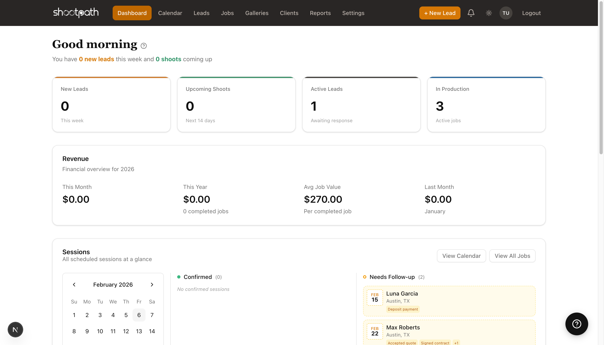

# Understanding Your Dashboard

## Quick Reference

Your dashboard is your command center in ShootPath - it shows you everything happening in your photography business right now.

**Key Metrics at a Glance:**

- **New Leads** - Client inquiries from the past week
- **Upcoming Shoots** - Sessions scheduled in the next 14 days
- **Active Leads** - Potential clients waiting for your response
- **In Production** - Jobs currently in progress (from contract signed to gallery delivered)
- **Revenue** - Total income for the current month and year

**Quick Actions:**
- Click **"+ New Lead"** in the top-right to add a client inquiry
- Use the navigation sidebar on the left to jump to Leads, Jobs, Clients, or Settings
- See the **"Learn about the dashboard"** link (with a ? icon) for context-specific help

**Recent Activity** shows what's happening across your business - quotes accepted, contracts signed, leads created - so you're always in the loop.

**Next Steps:** [Explore the interface](./interface-overview), [create your first lead](./creating-a-lead), or [explore jobs](./understanding-jobs).

---

## Detailed Guide

When you first log in to ShootPath, you'll land on your dashboard - think of it as mission control for your photography business. It shows you what's happening right now, what needs your attention, and gives you quick access to everything you need.

### Understanding Your Key Metrics

The metric cards at the top give you an instant snapshot of your business health:

#### New Leads
This shows how many potential clients have inquired in the past 7 days. Every time someone fills out your contact form or you manually add a lead, this number updates.

**Why it matters:** If you're seeing a lot of new leads, your marketing is working! If it's quiet, it might be time to share your work on social media or reach out to past clients for referrals.

#### Upcoming Shoots
Your next scheduled photography sessions over the next 14 days. This includes weddings, portraits, events - anything with a session date.

**Why it's useful:** You can see what you need to prepare for. Got a wedding this Saturday? Time to charge your batteries, check your gear, and confirm the timeline with your couple!

#### Active Leads
These are potential clients you're currently talking to - people who have inquired but haven't booked yet. They might be reviewing your quote, thinking it over, or waiting for you to follow up.

**What you can do:** Click the number to see all active leads and check who needs a follow-up email or phone call.

:::tip Pro Tip
Most photographers follow up after 3-5 days if they haven't heard back from a lead. ShootPath helps you track how long it's been since you sent that quote!
:::

#### In Production
This shows how many jobs are currently in progress - from the moment a client signs your contract until you deliver their final gallery.

**What counts as "in production"?**
- Contract signed ✓
- Payment received (or deposit paid) ✓
- Shoot completed or scheduled ✓
- Gallery not yet delivered ✓

Once you mark a job complete and deliver the gallery, it moves out of this count.

**Why this matters:** This number helps you manage your workload. If you're juggling 10 jobs, you know you're busy! If you only have 2, you might want to focus on converting those leads into bookings.

#### Revenue
Total income you've collected this month and year-to-date. This only counts *paid* invoices - not quotes or pending payments. This is real money that's already in your account.

**Why photographers love this:** You can see exactly how your month is going financially. Hit your income goal? Time to celebrate! 🎉 Falling short? Maybe it's time to send out that mini session announcement.

### Activity Feed

Below your metrics, you'll see a timeline of recent events:

- "Luna Garcia accepted your quote" (30 minutes ago)
- "New lead: Max Roberts" (2 hours ago)
- "Contract signed: Thompson Family" (yesterday)

**Why this is helpful:** You can see what happened while you were away shooting or editing. Did a client sign a contract? Did someone fill out your contact form? It's all here, so you never miss an important update.

### Quick Actions

The **"+ New Lead"** button in the top-right navigation lets you quickly add a client inquiry without navigating through multiple menus. Perfect when you just got off a phone call with a potential client!

### Navigation Sidebar

On the left, you'll see all the main sections of ShootPath:

- **Dashboard** - Where you are now
- **Calendar** - Your shoot schedule
- **Leads** - Potential clients and inquiries
- **Jobs** - Active photography projects
- **Galleries** - Photo delivery to clients
- **Clients** - Your contact database
- **Reports** - Business analytics and insights
- **Settings** - Configure your business info, packages, and integrations

:::tip Space Saving
You can collapse the sidebar if you need more screen space - it'll automatically expand when you hover over it.
:::

### Getting Help with HelpLinks

See that **"Learn about the dashboard"** link near the top? That's a HelpLink - it takes you straight to relevant documentation (like this article you're reading now!).

Throughout ShootPath, you'll see these contextual help links next to section headings and features. They're designed to help you learn as you go, without having to search through documentation.

**How to use them:**
1. Spot a feature you're curious about
2. Look for the help link (usually near the heading)
3. Click it to open the documentation in a new tab
4. Read, learn, come back to ShootPath

**Why we built this:** We know you're busy running a photography business! Instead of making you search for help, we put it right where you need it.

:::tip Great for New Users
If you're just getting started, try clicking the help links as you explore different sections. They'll teach you about each feature as you discover it!
:::

### Sessions Calendar

The calendar widget on your dashboard shows your upcoming shoots at a glance. You can see which dates have confirmed sessions and which need follow-up (like when a client accepted a quote but hasn't scheduled yet).

**Quick filters:**
- **Confirmed** - Sessions with a locked-in date and time
- **Needs Follow-up** - Jobs that need scheduling or have pending tasks

Click **"View Calendar"** to see your full schedule, or **"View All Jobs"** to dive into the details of each active project.

### Action Items

If there's anything that needs your immediate attention - like a quote that's about to expire or a client who hasn't responded in a while - you'll see it in the **Action Items** section.

This helps you prioritize your day: "Okay, I need to follow up with Sarah about her wedding quote, and check in with Mike about scheduling his portrait session."

:::warning Don't Panic!
New to CRM software? That's totally normal! Start with the basics (creating leads and sending quotes) and you'll be a pro in no time. You don't need to learn everything at once.
:::

### What's Next?

Now that you know your way around the dashboard, you're ready to start using ShootPath! Here are some common next steps:

**If you have a client inquiry:** [Create a new lead](./creating-a-lead) to track the conversation

**If you're ready to send pricing:** Start by creating a lead, then you can send them a quote with your packages

**If you've already booked someone:** [Learn about jobs](./understanding-jobs) to manage the whole workflow from contract to delivery

**Need to configure your business info?** Check out [Basic Settings](./basic-settings) to add your logo, contact info, and packages

---

**Questions?** Look for the help links throughout ShootPath, or reach out to support if you need a hand!
