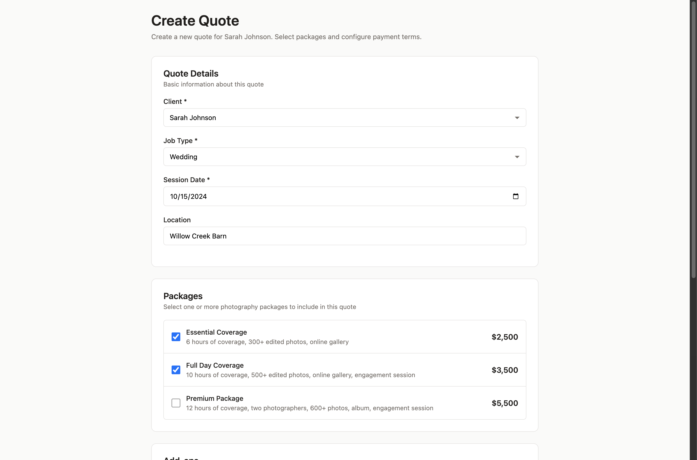
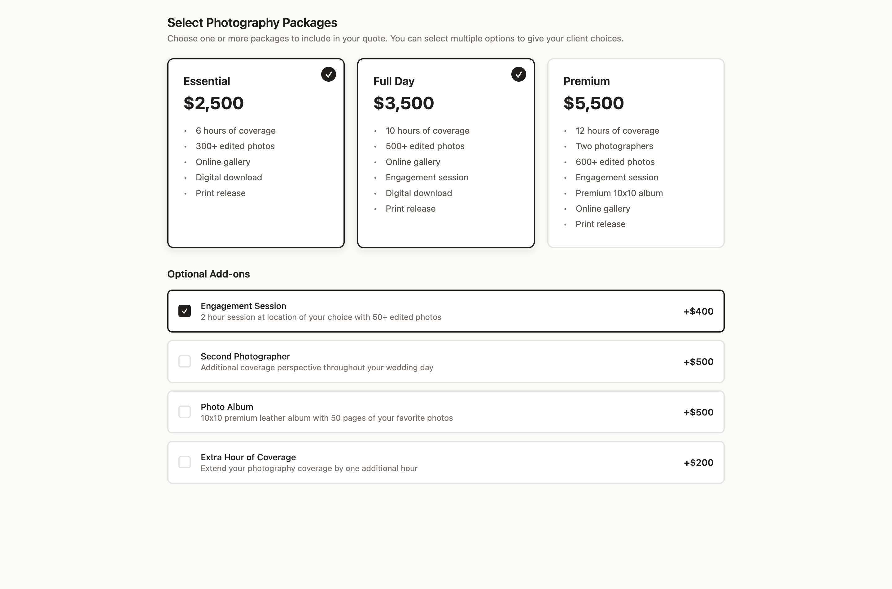
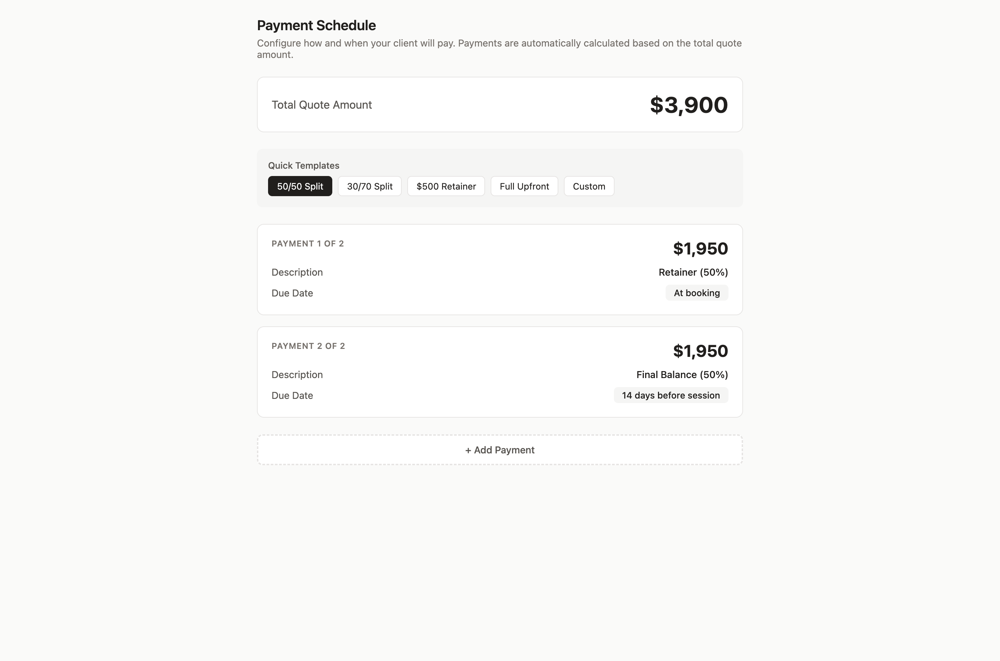
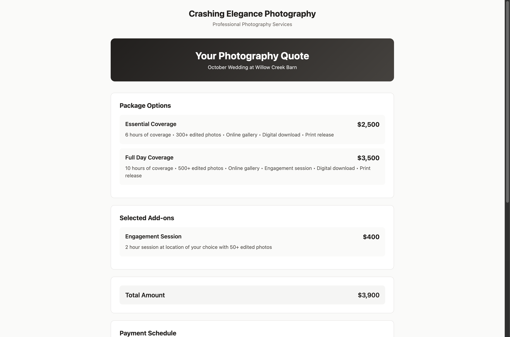

# Sending Your First Quote

:::warning Prerequisites
Before sending your first quote, make sure you've set up your [Packages, Add-ons, and Payment Schedules](./setting-up-your-business#3-packages--add-ons). Without these, you won't be able to create a quote!
:::

## Quick Reference

A quote is your professional pricing proposal that turns inquiries into bookings. After creating a lead, sending a quote is your next step!

**How to Send a Quote:**

1. Open the lead from your Leads list
2. Click **"Create Quote"**
3. Select packages and add-ons with pricing
4. Configure payment schedule (deposit + balance)
5. Preview how it looks to your client
6. Click **"Send Quote"**

<!-- TODO: Add screenshot -->
<!-- amp; -->

**What Happens Next:**
- Client receives an email with a link to view the quote
- They can review your pricing and packages online
- If they accept, ShootPath automatically creates a job
- You get notified immediately when they say yes!

**Next Steps:** After your client accepts the quote, they'll sign a contract and submit payment. Learn about this in [Understanding Jobs](./understanding-jobs).

---

## Detailed Guide

### What is a Quote?

A quote is your professional pricing proposal - think of it as saying "Here's what I offer and what it costs." It's how you turn a lead (someone interested) into a booked client (someone committed).

Your quote includes:
- **Packages** - Your service offerings (Full Day Wedding, Family Portrait Session, etc.)
- **Add-ons** - Optional extras they can include (engagement session, extra hour, albums)
- **Total pricing** - What they'll pay
- **Payment schedule** - When payments are due (deposit now, balance later)
- **Session details** - Date, location, what to expect

### Why Quotes Matter

Think about it from your client's perspective: they've reached out to 3-5 photographers. They're comparing pricing, offerings, and professionalism. A well-structured quote shows:

- **You're organized** - Everything is clear and professional
- **You value your work** - Proper pricing builds confidence
- **You make it easy** - Online review and acceptance, no back-and-forth
- **You're legitimate** - Professional presentation = trustworthy business

**The numbers:** Photographers who respond to inquiries within 24 hours with a clear quote book 70% more clients than those who delay or send unclear pricing. Speed + clarity = bookings!

### When to Send a Quote

Send a quote after:
- Initial consultation call or meeting
- You've answered their questions about your services
- You understand what they're looking for
- They seem genuinely interested in booking

**Don't send too early!** If someone just says "how much do you charge?" via Instagram DM, chat with them first. Understand their needs, build rapport, THEN send a tailored quote.

:::tip Pro Tip
Create the lead first (with notes about what they want), then send the quote. This keeps everything organized and tracked in one place!
:::

### Creating Your First Quote

Let's walk through the process step by step.

#### Step 1: Open the Lead

From your Leads list, click on the lead you want to quote. You'll land on the lead detail page where you can see:
- Client info
- What they inquired about
- Any notes you added
- Current status (probably "New")

#### Step 2: Click "Create Quote"

You'll see a **"Create Quote"** button in the top-right area of the lead detail page. Click it!

This opens the quote creation form where you'll build your pricing proposal.

#### Step 3: Select Packages

<!-- TODO: Add screenshot -->
<!-- amp; -->

Your packages are your core service offerings. Think of them as tiers:

**Wedding Example:**
- **Essential Coverage** - 6 hours, 300+ photos ($2,500)
- **Full Day Coverage** - 10 hours, 500+ photos, engagement session ($3,500)
- **Premium Package** - 12 hours, two photographers, album ($5,500)

**Portrait Example:**
- **Mini Session** - 30 minutes, 10 edited photos ($200)
- **Standard Session** - 1 hour, 25 edited photos ($350)
- **Extended Session** - 2 hours, on-location, 40 photos ($600)

Select the package (or packages) that match what the client asked for. You can include multiple if you want to give them options!

**Don't have packages set up yet?** Click "Manage Packages" to configure them first. See the tips section below for pricing guidance.

#### Step 4: Add Optional Add-ons

Add-ons are extras that clients can include to customize their package:

**Common add-ons:**
- Extra hour of coverage (+$200)
- Second photographer (+$500)
- Engagement session (+$400)
- Photo album (+$500)
- Rush editing (+$200)
- Canvas prints (+$150)

Include add-ons that make sense for this client. If they mentioned "we'd love an engagement session," make sure to add that!

You can add multiple add-ons - the total price updates automatically.

:::tip Pricing Strategy
Price your base package competitively, but use add-ons to increase average booking value. A client who books a $2,500 wedding package + $400 engagement session + $500 album = $3,400 total!
:::

#### Step 5: Configure Payment Schedule

<!-- TODO: Add screenshot -->
<!-- amp; -->

How do you want to split up the payments? Common options:

**50/50 Split**
- 50% due at booking (to secure your date)
- 50% due before the shoot

**Retainer + Balance**
- Fixed retainer (like $500) due at booking
- Remaining balance due 2 weeks before shoot

**Full Upfront**
- 100% due at booking
- Great for mini sessions or smaller bookings

**Custom Schedule**
- Multiple payments over time
- Perfect for weddings booked far in advance
- Example: $500 at booking, $1,000 three months before, remainder 2 weeks before

For each payment, you'll set:
- **Amount** - How much is due
- **Due date** - When it needs to be paid
- **Description** - What this payment is for ("Retainer," "Final Balance," etc.)

**Why payment schedules matter:** They protect your business by securing bookings with a deposit, and they make large amounts more manageable for clients by splitting them up.

:::warning Important Rule
Once a client accepts your quote, they MUST sign the contract before they can pay. This protects both of you! And if multiple payments become due, they must pay all due amounts together (they can't cherry-pick).
:::

#### Step 6: Review Session Details

Make sure the session date, location, and job type are correct. These were filled in from the lead, but double-check them!

- **Session Date** - When the shoot is happening
- **Job Type** - Wedding, Portrait, Event, etc.
- **Location** (optional) - Where you'll be shooting

#### Step 7: Add a Personal Note (Optional)

Include a brief message to your client! This personalizes the quote and reminds them why they reached out to you.

**Example notes:**
```
Hi Sarah!

It was so great chatting with you about your family portraits! I love that you want
to capture everyone together before your oldest heads off to college. Fall colors
at the park will be absolutely beautiful for your session.

I've put together pricing below based on what we discussed. Let me know if you
have any questions - I'm here to help!

Looking forward to working with you!
```

Keep it warm, friendly, and brief (3-4 sentences is perfect).

#### Step 8: Preview the Quote

Before sending, click **"Preview"** to see exactly what your client will see. This opens the quote in client view, showing:

- Your business name and logo
- Package and add-on details
- Total pricing
- Payment schedule
- Session information
- Accept/Decline buttons

**Check everything carefully:**
- Pricing looks correct
- No typos in descriptions
- Your logo and branding appear properly
- Payment schedule makes sense

If anything looks off, click "Back to Edit" and fix it.

#### Step 9: Send the Quote!

Happy with how it looks? Click **"Send Quote"** and ShootPath will:

1. **Email the client** with a link to view the quote online
2. **Update the lead status** to "Quoted"
3. **Track how long the quote has been pending**
4. **Notify you** when they view it or take action

The quote is now with your client! 🎉

### What Clients See

<!-- TODO: Add screenshot -->
<!-- amp; -->

When your client clicks the link in their email, they land on a beautiful, branded quote page showing:

**Overview Section:**
- Your business name and logo
- What they're booking (job type, date)
- Total price (large and clear)

**Package Details:**
- What's included in each package
- Pricing for each
- Add-ons they can include

**Payment Schedule:**
- When payments are due
- Amount for each payment
- Descriptions of what each covers

**Action Buttons:**
- **Accept Quote** - Green button to say yes and move forward
- **Decline** or **"Have Questions?"** - Option to reach out

Everything is mobile-friendly, so they can review and accept from their phone!

### The Acceptance Flow

When a client accepts your quote, here's what happens automatically:

1. **Quote status changes to "Accepted"**
2. **ShootPath creates a Job** with all the details
3. **Contract is generated** from your template
4. **Client receives email** to sign the contract
5. **You get notified** that they accepted!
6. **Lead converts to Job** and moves to your jobs list

The client then:
- Reviews and signs the contract online
- Submits their first payment (deposit/retainer)
- Gets a booking confirmation email
- Can access their client portal to see everything

**All of this happens automatically!** You just need to check in and make sure contract signing and payment go smoothly.

### Best Practices for Quotes

#### Respond Quickly

**The 24-hour rule:** Aim to send quotes within 24 hours of the inquiry (ideally within a few hours). The faster you respond, the more likely you are to book!

Your potential client is excited RIGHT NOW. Strike while the iron is hot.

#### Tailor Each Quote

Don't send the same generic quote to everyone. Reference specific things they mentioned:

❌ "Here's my standard wedding pricing"
✅ "Here's pricing for your October wedding at Willow Creek Barn"

Small personalizations show you were listening and care about their specific event.

#### Keep It Simple

**Don't overwhelm them** with 6 different package options or 20 add-ons. Give them:
- 2-3 package options (good, better, best)
- 3-5 relevant add-ons
- Clear, straightforward pricing

Too many choices = decision paralysis = no booking.

#### Price with Confidence

Don't apologize for your pricing or say "I know this might seem expensive but..." Your pricing reflects your skill, experience, and value. Present it confidently!

**Weak:** "I hope this pricing works for your budget"
**Confident:** "I've put together pricing based on what you're looking for"

:::tip Pricing Strategy
Price based on your costs, time, skill level, and desired income - NOT what you think clients can afford or what your competitor charges. Know your worth!
:::

#### Include Value, Not Just Features

**Features tell, value sells:**

❌ "Package includes 8 hours of coverage"
✅ "8 hours of coverage means I'll capture everything from getting ready through your first dances"

❌ "You get 400 edited photos"
✅ "400+ professionally edited photos so you can relive every moment of your day"

Help them understand WHY your packages matter, not just WHAT they include.

#### Make the Next Step Clear

Your quote should end with a clear call to action:
- "Ready to book? Click Accept below!"
- "Questions? Reply to this email anytime!"
- "Your date is available - let's make this official!"

Don't leave them wondering "okay, so... now what?"

### Common Quote Structures

Different photography genres typically use different pricing structures. Here's what's common:

#### Wedding Quotes

**Packages based on time/coverage:**
- 6-hour package ($2,000-$3,000)
- 8-hour package ($3,000-$4,500)
- Full-day package ($4,500-$7,000+)

**Popular add-ons:**
- Engagement session
- Second photographer
- Photo albums
- Parent albums
- Extended hours

**Payment schedule:**
- $500-$1,000 retainer at booking
- 50% due 3 months before wedding
- Remainder due 2 weeks before wedding

#### Portrait Session Quotes

**Packages based on session length:**
- Mini session - 30 min ($150-$300)
- Standard session - 60 min ($300-$500)
- Extended session - 90+ min ($500-$800)

**Popular add-ons:**
- Additional outfit changes
- Extra locations
- Canvas prints
- Photo albums
- Digital files (if not included)

**Payment schedule:**
- 50% at booking
- 50% before session
- OR full payment at booking

#### Event Quotes

**Packages based on hours:**
- 2-hour minimum ($400-$600)
- 4 hours ($800-$1,200)
- Full day ($1,500-$2,500)

**Popular add-ons:**
- Second photographer
- Rush delivery
- Additional edited photos
- Photo booth

**Payment schedule:**
- Often 100% upfront
- Or 50% at booking, 50% day-of-event

### After Sending the Quote

#### Track It

ShootPath shows you:
- When the quote was sent
- How many days it's been pending
- Whether they've viewed it
- Current status (pending, accepted, declined)

Check your Leads list regularly to see which quotes need follow-up.

#### Follow Up

If you haven't heard back in 3-5 days, send a friendly follow-up:

```
Hi Sarah!

Just wanted to check if you had any questions about the quote I sent over
for your family session? I'm happy to hop on a quick call if that's easier!

Your October 15th date is still available, but I wanted to make sure you
had everything you need to make a decision.

Let me know how I can help!
```

**Don't be pushy**, but DO follow up. Many clients get busy and forget - a gentle reminder is often all they need!

#### Handle Questions Gracefully

If they reply with questions or objections:

**"Can you do a lower price?"**
Instead of dropping your price immediately, ask what's driving the question. Maybe they don't need all the add-ons, or a smaller package would work better. Offer value adjustments before price drops.

**"What's included in editing?"**
Have clear answers ready. "All photos are professionally color-corrected, exposure-adjusted, and run through my signature editing style. You'll receive high-resolution digital files ready to print or share."

**"How many photos will we get?"**
Be specific! "You'll receive at least 400 edited photos from your wedding day. Most clients get 500-600 depending on the timeline."

### When a Quote is Declined

Not every quote turns into a booking - and that's okay! If a client declines:

**Don't take it personally** - They might have budget constraints, chosen another photographer, or decided to postpone.

**Ask for feedback** - "I appreciate you letting me know! Can I ask what helped you make your decision?" Honest feedback helps you improve.

**Keep the door open** - "If anything changes or you need a photographer in the future, I'd love to work with you!"

**Mark it in ShootPath** - Update the lead status to "Lost" so you know it's not active anymore. Add a note about why (budget, timing, went with competitor) to track patterns.

### Tips for Higher Conversion

**Build rapport first** - Have a conversation before sending the quote. Understand their vision, answer questions, get them excited. THEN send pricing.

**Educate on value** - Help them understand what goes into your work: your time shooting, editing hours, gear investment, expertise, insurance, etc.

**Show your work** - Link to your portfolio or Instagram. Let them see the quality they're paying for.

**Create urgency (honestly)** - "Your date is currently available, but I do book up quickly for fall sessions." Don't manufacture fake scarcity, but do be honest about availability.

**Make it easy to say yes** - Online review and acceptance, clear next steps, professional presentation. Remove friction!

**Offer a consultation** - "Want to chat before deciding? I'm happy to hop on a 15-minute call!" Sometimes people just need to connect with you first.

:::tip Pro Tip
Track your conversion rate! If you're sending 10 quotes and booking 2 clients, that's 20%. Industry average is 30-40%. If yours is lower, examine your follow-up process, pricing clarity, or how you're qualifying leads before quoting.
:::

### Setting Up Your Packages

Before you can send quotes, you'll need to configure your packages in Settings. Here's a quick guide:

**Go to:** Settings > Packages & Add-ons

**For each package, define:**
- **Name** - "Full Day Wedding Coverage"
- **Description** - What's included (hours, photo count, deliverables)
- **Price** - What it costs
- **Job types** - Which types of jobs this package applies to

**Package pricing tips:**
- **Cost-based pricing** - Calculate your costs (time, editing, gear) + desired profit
- **Value-based pricing** - Price based on what it's worth to the client (wedding photos are priceless!)
- **Competitive research** - Know what others charge in your market, but don't just match them
- **Don't undercharge** - New photographers often charge too little. Price for the value you provide!

**Add-on pricing tips:**
- Price add-ons to cover your actual costs + time
- Make sure add-ons are profitable (don't add $50 albums that cost you $40 + 2 hours to design)
- Use add-ons to increase average booking value

### What's Next?

Now that you know how to send quotes, you're ready to start booking clients!

**Your quote workflow:**
1. [Create a lead](./creating-a-lead) for each inquiry
2. Have a conversation to understand what they need
3. **Send a tailored quote** with packages and pricing ← You are here!
4. Follow up if needed
5. When they accept, [manage the job](./understanding-jobs) from contract to delivery

**Want to customize your packages?** Head to [Basic Settings](./basic-settings) to configure your photography packages and pricing

**Need help with contract templates?** Check out the Contracts section

**Ready to set up payment processing?** Learn about the Stripe integration in Settings

---

**Questions?** Look for the help links throughout ShootPath, or reach out to support if you need help!
