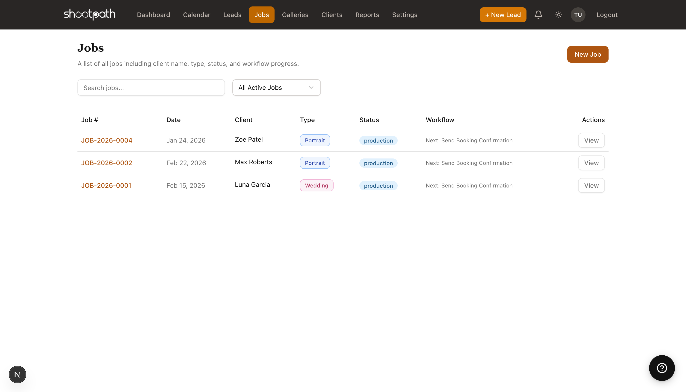
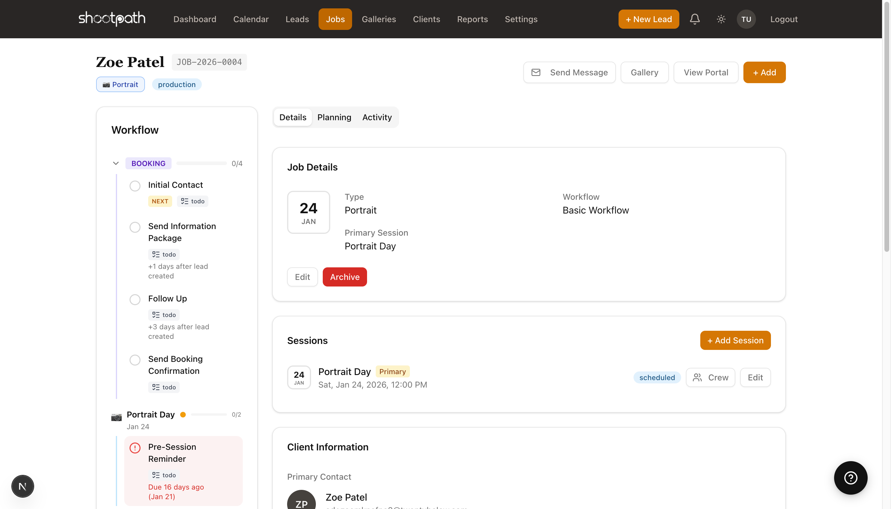

# Understanding Jobs

## Quick Reference

A job in ShootPath represents an active photography project - from the moment a client books you until you deliver their final gallery.

**Key Concepts:**

- Jobs are created when a client accepts your quote
- Each job has a workflow that guides you through the process
- Track contracts, payments, shoot dates, and gallery delivery all in one place
- View all active jobs from the Jobs page in the sidebar

**What's in a Job:**
- **Client info** - Who you're shooting for
- **Contract** - Client signature and agreement
- **Invoices** - Deposits and final payments
- **Workflow tasks** - Step-by-step checklist to delivery
- **Files & Gallery** - Where you'll upload and share photos
- **Timeline** - Activity log of everything that's happened

**Job Statuses:**
- **Production** - Active job in progress
- **Complete** - Gallery delivered, job closed

**Next Steps:** [Learn about contracts and payments](#) or [explore gallery delivery](#).

---

## Detailed Guide

### What is a Job?

Think of a job as your complete project file for a client booking. When someone says "yes, let's do this!" and accepts your quote, ShootPath creates a job to help you manage everything from that point forward.

A job keeps track of:
- **The contract** - Getting their signature and agreement
- **Payments** - Deposit, balance, and payment schedules
- **The shoot** - Session date, location, and timeline
- **Your workflow** - Tasks like "send questionnaire" or "deliver sneak peeks"
- **The gallery** - Final photo delivery to your client
- **Communication** - Every email, note, and status update

### How Jobs are Created

There are two ways jobs get created in ShootPath:

**1. From an accepted quote (most common)**
When a client reviews your quote and clicks "Accept," ShootPath automatically:
- Creates the job
- Generates the contract for signature
- Sets up the payment schedule you defined
- Assigns the appropriate workflow based on job type

**2. Manual creation**
Sometimes you need to create a job directly (for a returning client, or if you booked someone outside the system):
1. Go to Jobs > New Job
2. Select the client
3. Choose the job type
4. Fill in pricing and session details
5. ShootPath sets up everything like normal

### The Job Detail Page

When you open a job, you'll see everything about that booking in one place. Let's walk through each section:

#### Overview Tab

The overview shows:
- **Client name and contact info** - Quick access to email and phone
- **Job number** - Each job gets a unique identifier (like JOB-2026-0001)
- **Session date and location** - When and where the shoot is happening
- **Job type and status** - Wedding, Portrait, etc. and whether it's active or complete
- **Quick stats** - Total pricing, payment status, days until shoot

#### Contract Section

Every job needs a contract before you can proceed. Here's the typical flow:

1. **After quote accepted** - ShootPath generates a contract from your template
2. **Client receives email** - With a link to review and sign online
3. **Client signs** - Digital signature right in their browser
4. **You're notified** - Contract status changes to "Signed"
5. **Download anytime** - Get a PDF copy for your records

**Why this matters:** You can't accept payment until the contract is signed (by default). This protects both you and your client by making sure everyone agrees to the terms before money changes hands.

:::tip Pro Tip
Customize your contract template in Settings > Templates. Include your cancellation policy, usage rights, and any specific terms for your business!
:::

#### Invoices & Payments

ShootPath handles your payment schedule automatically based on what you set up in the quote:

**Common payment structures:**
- **50/50** - 50% deposit to book, 50% before the shoot
- **Retainer + Balance** - Fixed retainer (like $500), remainder before delivery
- **Full upfront** - 100% to book (common for mini sessions)
- **Custom schedule** - Multiple payments over time (great for weddings)

You'll see:
- **Which payments are due** - Color-coded by status (paid, overdue, upcoming)
- **Payment links for your client** - Copy and send, or they'll get them via email
- **Payment history** - When each payment was received
- **Total collected vs. total due**

:::warning Payment Rule
If multiple payments are overdue or due now, clients must pay ALL due amounts together. They can't cherry-pick individual invoices. This prevents confusion about what's been paid!
:::

#### Workflow Tasks

Every job type has a workflow - a series of steps that guide you from booking to delivery. Think of it as your process, automated.

**Example Portrait Workflow:**
1. ✅ Quote Accepted
2. ✅ Contract Signed
3. 📧 Send Booking Confirmation
4. 📋 Send Client Questionnaire
5. 📸 Conduct Photo Session
6. 🎨 Edit & Prepare Gallery
7. 📤 Deliver Final Gallery
8. ✅ Job Complete

Each task shows:
- **Status** - Not started, in progress, or complete
- **Description** - What you need to do
- **Actions** - Quick buttons to send emails or mark complete

**Why workflows are powerful:** They make sure you never forget important steps. No more "oops, I forgot to send the questionnaire!" The workflow keeps you on track.

You can customize workflows in Settings > Workflows for each job type.

#### Files & Gallery

This is where you'll:
- **Upload photos** - Drag and drop your edited images
- **Create galleries** - Organize photos into collections
- **Share with clients** - Send them a beautiful online gallery
- **Track downloads** - See which photos they loved

The gallery delivery step is usually the final task in your workflow. Once you deliver the gallery and the client is happy, you can mark the job complete!

#### Timeline & Activity

The timeline shows a chronological log of everything that's happened:
- Quote accepted (Jan 15)
- Contract sent (Jan 15)
- Contract signed (Jan 16)
- Deposit payment received (Jan 16)
- Questionnaire sent (Jan 20)
- Session completed (Feb 3)
- Gallery delivered (Feb 10)

This is super helpful for remembering "wait, when did I send them that questionnaire?" or "when did they pay the deposit?"

### Job Statuses Explained

Jobs move through a simple status lifecycle:

**Production (Active)**
The job is in progress - you're working on it! This could mean:
- Waiting for the client to sign the contract
- Waiting for payment
- Scheduled shoot coming up
- Editing photos
- Anything before final delivery

**Complete**
You've delivered the final gallery and the job is done. The client has their photos, you've been paid, everyone's happy! 🎉

Jobs in "Complete" status don't show up in your active job count on the dashboard, but you can always find them by filtering the jobs list.

### Common Job Workflows

Different types of photography have different workflows. Here's what's typical:

**Wedding Jobs:**
- Longer timeline (often booked 6-12 months out)
- Multiple payments (retainer, payment before wedding, final payment)
- More workflow steps (engagement session, timeline planning, vendor coordination, gallery delivery)
- Larger galleries (hundreds of photos)

**Portrait Sessions:**
- Shorter timeline (often booked 2-6 weeks out)
- Simple payment (deposit + balance)
- Streamlined workflow (questionnaire, shoot, deliver)
- Smaller galleries (20-50 edited photos)

**Event Jobs:**
- Quick turnaround
- Often full payment upfront
- Fast delivery (1-2 weeks)

You can customize these workflows in Settings to match your specific process!

### Managing Multiple Jobs

As you grow, you'll have multiple jobs happening at once. Here's how to stay organized:

**Use the Jobs List**
Filter and sort to find what you need:
- Show only jobs with payments due
- See which sessions are coming up this week
- Find jobs stuck on a specific workflow step

**Check Your Dashboard**
The "In Production" metric shows your current workload at a glance.

**Set Reminders**
If a client needs to do something (sign contract, pay deposit), ShootPath will help you track it. You can send them friendly reminder emails right from the job page.

:::tip Pro Tip
Block out editing time on your calendar after each shoot. It's easy to over-book yourself if you don't account for editing and delivery time!
:::

### From Lead to Completed Job

Here's the full journey:

1. **Lead created** - Client inquires
2. **Quote sent** - You send pricing
3. **Quote accepted** - Client says yes! 🎉
4. **Job created** - ShootPath sets up everything
5. **Contract signed** - Client signs agreement
6. **Deposit paid** - Money received, booking confirmed
7. **Workflow steps** - You work through your process
8. **Shoot happens** - The fun part!
9. **Gallery delivered** - Photos shared with client
10. **Final payment** - Remaining balance collected
11. **Job complete** - Close out the job

Each step is tracked in ShootPath so you always know where you are!

### Tips for Managing Jobs

**Keep your job status current** - Mark tasks complete as you finish them. It helps you see what's next at a glance.

**Use notes liberally** - Add notes about client preferences, special requests, or anything unusual. Future-you will thank you!

**Track your time** - If a job is taking longer than expected, make a note. This helps you price more accurately in the future.

**Communicate proactively** - Send status updates to your clients: "I'm starting on your edits this week!" or "Gallery will be ready by Friday!" They'll appreciate knowing where things stand.

### What's Next?

Now that you understand jobs, you're ready to manage your full client workflow!

**Want to customize your workflows?** Learn about workflow configuration in Settings

**Need help with contracts?** Check out the Contracts & Invoicing guide

**Ready to deliver galleries?** Explore the Gallery Delivery documentation

**Just getting started?** Go back to [Creating a Lead](./creating-a-lead) to build your client pipeline

---

**Questions?** Look for the help links throughout ShootPath, or reach out to support if you need help!
