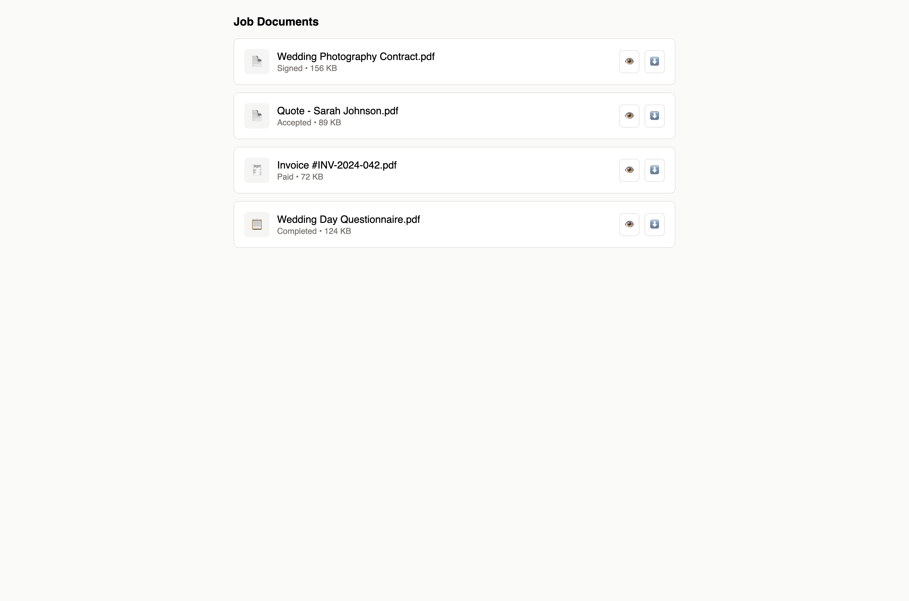

# Job Files

## Quick Reference

Every job generates and collects various files throughout the client journey—contracts, invoices, questionnaire responses, and final photo galleries. ShootPath centralizes all these files in one place.

**Types of Job Files:**

- **Contracts** - Legal agreements clients sign
- **Invoices** - Payment documents and receipts
- **Questionnaires** - Client responses to pre-session questions
- **Galleries** - Photo collections you deliver
- **Uploaded Files** - Documents you or clients upload (timelines, shot lists, inspiration)

**Where to Find Files:**

- **Job Detail Page** - Each file type has its own tab or section
- **Files Tab** - Centralized view of all uploaded documents
- **Client Portal** - Clients can access their files via secure portal link

**Common Actions:**
- Download signed contracts
- View payment receipts
- Review questionnaire responses
- Upload session files or documents
- Create and deliver galleries

<!--  -->

**Next Steps:** Learn how to [work with contracts](#contracts), [manage invoices](#invoices), [use questionnaires](#questionnaires), and [deliver galleries](#galleries).

---

## Detailed Guide

### Why File Management Matters

Organized file management keeps you professional and efficient:

**For you:**
- All client files in one place (no hunting through email)
- Easy access to signed contracts and payment records
- Quick reference to client preferences from questionnaires
- Streamlined gallery delivery process

**For clients:**
- Professional experience (everything accessible in their portal)
- Self-service access (view contracts, make payments, download photos)
- Clear documentation of what was agreed to
- Permanent access to their galleries

### Contracts

Contracts are legal agreements between you and your client. They protect both parties by clearly defining expectations, deliverables, payment terms, cancellation policies, and usage rights.

#### How Contracts Work in ShootPath

**1. Contract Generation**

When a client accepts a quote, ShootPath automatically:
- Creates a contract from your template
- Populates it with job details (client name, date, pricing, etc.)
- Generates a unique signing link
- Sends email to client with link to review and sign

**2. Client Signing**

Client receives the email and:
- Clicks the link to open contract in browser
- Reviews all terms
- Signs electronically (typed signature or drawn)
- Submits the signed contract

**3. Contract Completion**

After signing:
- ShootPath stores the signed contract as a PDF
- Notifies you that contract is signed
- Unlocks payment ability (by default, clients can't pay until contract is signed)
- Marks workflow task "Contract Signed" as complete

:::tip Contract-Before-Payment Rule
By default, clients must sign the contract before they can make any payments. This protects both parties by ensuring agreement to terms before money changes hands. You can disable this in job settings if needed.
:::

#### Viewing Contracts

**To view a contract:**

1. Open the job
2. Go to the **Contract** tab
3. See contract status (pending, sent, signed)
4. Click "View Contract" or "Download PDF" to see the document

**Contract statuses:**

- **Pending** - Contract generated but not sent yet
- **Sent** - Email sent to client, awaiting signature
- **Signed** - Client has signed, contract is complete
- **Declined** - Client declined to sign (rare)

#### Resending Contracts

If a client didn't receive the contract email or needs it resent:

1. Go to Contract tab in the job
2. Click **"Resend Contract"**
3. ShootPath sends another email with the signing link

**Common reasons to resend:**
- Email went to spam
- Client deleted the email
- Email address was wrong (update it first, then resend)
- Client needs more time and wants a reminder

#### Downloading Signed Contracts

Once signed, you can download the contract for your records:

1. Open the job
2. Go to Contract tab
3. Click **"Download PDF"**
4. Save to your computer

**When to download:**
- For your business records (keep offline backups)
- To provide copy to client (if they request it)
- For accounting or legal purposes
- When archiving old jobs

:::tip Backup Signed Contracts
Periodically download signed contracts and back them up to external storage (Dropbox, Google Drive, external hard drive). While ShootPath stores them securely, it's good practice to have your own copies!
:::

#### Customizing Contract Templates

Contracts are generated from templates you configure in Settings. See the [Contracts](../contracts/) section for detailed guidance on:
- Creating contract templates
- Adding custom terms and policies
- Using variables (client name, pricing, etc.)
- Setting up electronic signature fields

### Invoices

Invoices document the payments due and received for each job. ShootPath automatically creates invoices based on the payment schedule you set up in the quote.

#### How Invoices Work

**1. Invoice Creation**

When a job is created (from an accepted quote), ShootPath generates invoices for each payment in the schedule:

**Example: 50/50 Payment Schedule**
- Invoice #1: Deposit ($500), due at booking
- Invoice #2: Balance ($500), due 1 week before session

**2. Invoice Delivery**

Invoices are automatically emailed to clients:
- When the job is created (first invoice)
- When previous payment is received (next invoice in schedule)
- When manually sent by you

**3. Payment Collection**

Clients can pay invoices via:
- Stripe (credit card, debit card)
- ACH bank transfer (if configured)
- Manual methods (cash, check, Venmo) - you mark as paid manually

**4. Payment Confirmation**

After payment:
- Invoice status changes to "Paid"
- Receipt is automatically emailed to client
- Workflow task "Payment Received" triggers
- Next invoice in schedule is sent (if applicable)

#### Viewing Invoices

**To view invoices for a job:**

1. Open the job
2. Go to the **Invoices** tab
3. See all invoices for this job with statuses

**Invoice information shown:**
- Invoice number (e.g., INV-2026-0042)
- Amount due
- Due date
- Status (draft, sent, paid, overdue)
- Date paid (if paid)
- Payment method used

Click any invoice to see full details or download PDF.

#### Invoice Statuses

- **Draft** - Invoice created but not sent yet (uncommon for auto-generated invoices)
- **Sent** - Invoice sent to client, awaiting payment
- **Paid** - Payment received in full
- **Partial** - Part of the invoice paid (if you allow partial payments)
- **Overdue** - Due date passed and payment not received
- **Cancelled** - Invoice cancelled (job cancelled or terms changed)

#### Payment Links

Each invoice has a unique payment link. Clients can:
- Click link in email to view invoice and pay
- Access via client portal

**To copy payment link:**

1. Go to Invoices tab in job
2. Find the invoice
3. Click **"Copy Payment Link"**
4. Paste into email, text, or message to client

**When to share payment links:**
- Client lost the original email
- Following up on overdue payment
- Easier than emailing (send via text)

:::warning Forced Payment Rule
If multiple invoices are due or overdue, clients must pay ALL due amounts together. They can't cherry-pick individual invoices. This prevents confusion and ensures all due payments are collected!
:::

#### Manual Payments

If a client pays via cash, check, Venmo, or other non-integrated methods, you'll manually mark the invoice as paid:

1. Go to Invoices tab
2. Find the invoice
3. Click **"Record Payment"**
4. Enter:
   - Amount paid
   - Payment method (cash, check, etc.)
   - Payment date
   - Transaction reference (check number, Venmo note, etc.)
5. Save

The invoice is now marked paid, and the client receives a receipt email (even for manual payments).

#### Downloading Invoices

**To download an invoice PDF:**

1. Go to Invoices tab
2. Click the invoice
3. Click **"Download PDF"**
4. Save to your computer

Useful for:
- Your records
- Providing copy to client
- Accounting and bookkeeping
- Tax purposes

#### Refunds

If you need to refund a payment:

**For Stripe payments:**
1. Go to your [Stripe Dashboard](https://dashboard.stripe.com/)
2. Find the payment
3. Click "Refund"
4. Choose full or partial refund
5. Confirm

**In ShootPath:**
- Mark the invoice as "Refunded" (status update)
- Add a note explaining the refund
- If needed, adjust the job pricing or create a new invoice

Refunds are handled through Stripe, not directly in ShootPath. ShootPath tracks the refund for your records.

:::tip Refund Policy
Have a clear refund policy in your contract! Common policies: full refund with 30+ days notice, 50% refund with 14-30 days, no refund within 14 days of session.
:::

### Questionnaires

Questionnaires gather important information from clients before the session. They help you understand client expectations, preferences, and logistical details.

#### What Questionnaires Capture

**Typical questions:**

**For Portrait Sessions:**
- What style do you prefer? (posed, candid, mix)
- What will you use the photos for? (cards, wall art, social media)
- Any specific shots you want? (whole family, just kids, specific combinations)
- Outfit colors/style?
- Any concerns? (kids are shy, grandma has limited mobility)

**For Weddings:**
- What's your vision/theme for the day?
- Key family members and relationships (who's important to photograph)
- Family dynamics (divorced parents, step-families)
- Must-have shots (specific combinations, heirlooms, details)
- Vendors (planner, venue, videographer contact info)
- Special requests or concerns

**For Events:**
- What's the purpose of the event?
- Key moments to capture (speakers, awards, group photos)
- VIPs to photograph
- Branding requirements (logos, colors)
- Deliverable format (web gallery, print, USB)

#### How Questionnaires Work

**1. Questionnaire Creation**

You create questionnaire templates in **Settings > Questionnaires**:
- Add questions (text, multiple choice, checkboxes, date pickers)
- Assign to job types (portrait questionnaire, wedding questionnaire)
- Set as default (auto-sends for jobs of that type)

**2. Sending Questionnaires**

Questionnaires are sent to clients:
- Automatically via workflow task (e.g., "Send Questionnaire" after deposit paid)
- Manually by clicking "Send Questionnaire" in job

**3. Client Completion**

Client receives email with link to questionnaire:
- Opens in browser (no login required, uses secure token)
- Fills out all fields
- Submits responses

**4. Response Storage**

After submission:
- Responses stored in ShootPath
- You're notified that questionnaire is complete
- Workflow task "Questionnaire Received" marked complete
- You can review responses anytime

#### Viewing Questionnaire Responses

**To view responses:**

1. Open the job
2. Go to the **Files** tab or **Questionnaire** section
3. Click **"View Responses"**
4. See all questions and client's answers

**Why review responses:**
- Prepare for the session with client's preferences in mind
- Avoid missing important shots
- Understand family dynamics or special considerations
- Coordinate logistics (arrival time, parking, etc.)

:::tip Review Before Session
Always review questionnaire responses 1-2 days before the session. It refreshes your memory and ensures you're prepared for what the client wants!
:::

#### Exporting Responses

You can export questionnaire responses as PDF or CSV:

**PDF Export:**
- Clean, formatted view of all questions and answers
- Great for printing and bringing to session
- Share with second shooters or assistants

**CSV Export:**
- Spreadsheet format
- Useful for analyzing trends across multiple clients
- Can be imported into other tools

**To export:**

1. View questionnaire responses
2. Click **"Export"**
3. Choose format (PDF or CSV)
4. Download file

#### Incomplete Questionnaires

If a client hasn't completed the questionnaire, you'll see status as "Sent, not completed."

**To follow up:**

1. Go to questionnaire section in job
2. Click **"Send Reminder"**
3. ShootPath emails client a friendly reminder

**If client still doesn't complete:**
- Call or text them directly
- Ask questions during pre-session consultation
- Bring blank questionnaire to session (less ideal, but better than nothing)

:::warning Deadline for Questionnaires
Set a deadline for questionnaire completion—ideally 1-2 weeks before the session. This gives you time to review and prepare. Include deadline in the questionnaire email!
:::

### Galleries

Galleries are where you deliver final photos to clients. This is the culmination of the entire project!

#### Creating Galleries

**To create a gallery for a job:**

1. Edit and export photos from your editing software (Lightroom, Capture One, etc.)
2. Open the job in ShootPath
3. Go to the **Gallery** or **Files** tab
4. Click **"Create Gallery"**
5. Upload photos:
   - Drag and drop files
   - Or click to browse and select
   - ShootPath uploads and processes them
6. Organize photos:
   - Create collections or albums (wedding: getting ready, ceremony, reception)
   - Arrange photo order
   - Set cover photo
7. Configure gallery settings:
   - Download options (full res, web size, or no downloads)
   - Watermarking (if applicable)
   - Favorites (allow client to mark favorites)
   - Sharing (allow client to share with family/friends)
8. Save gallery

#### Gallery Features

**What clients can do in their gallery:**

**View Photos:**
- Browse all photos in grid or slideshow view
- Zoom in to see details
- Navigate with keyboard arrows

**Download Photos:**
- Download individual photos
- Download entire gallery as zip
- Choose size (if you offer multiple sizes)

**Mark Favorites:**
- "Heart" or "favorite" specific photos
- You can see which photos they loved
- Useful for print orders or album selection

**Share with Others:**
- Generate shareable link for family/friends
- Set password protection (optional)
- Track who viewed

**Order Prints** (if integrated):
- Select photos for prints, canvases, albums
- Place orders through integrated print lab
- You fulfill or the lab ships direct

:::tip Watermarking
Decide whether to watermark gallery photos. Some photographers watermark for protection, others don't because it affects the viewing experience. There's no right answer—choose what works for your business!
:::

#### Delivering Galleries

Once the gallery is ready:

1. Preview it yourself to ensure everything looks right
2. Click **"Send Gallery"** or **"Deliver to Client"**
3. ShootPath emails client with link to view gallery
4. Workflow task "Gallery Delivered" is marked complete

**Gallery delivery email includes:**
- Link to gallery
- Instructions for viewing, downloading, sharing
- Your message (personalized note)
- Contact info if they have questions

#### Gallery Access

Clients access galleries via:
- **Link in delivery email** - Unique URL for this gallery
- **Client portal** - All their galleries in one place

Gallery access is permanent (unless you set expiration). Clients can return months or years later to re-download photos.

**Gallery URLs look like:**
```
https://yoursite.shootpath.com/gallery/abc123def456
```

The token (`abc123def456`) grants access—no login required.

:::tip Gallery Expiration
Some photographers set gallery expiration (e.g., 6 months after delivery) to encourage timely downloads and reduce storage costs. Others offer lifetime access as a selling point. Choose what fits your business model!
:::

#### Gallery Analytics

ShootPath tracks gallery engagement:

- **Views** - How many times the gallery was opened
- **Downloads** - Which photos were downloaded
- **Favorites** - Which photos clients marked as favorites
- **Shares** - How many people accessed via shared link

**Why analytics matter:**
- See which photos clients loved (favorites)
- Know if they've actually viewed the gallery (views)
- Confirm they downloaded everything (downloads)
- Understand client behavior for future shoots

**To view gallery analytics:**

1. Open the job
2. Go to Gallery section
3. Click **"View Analytics"** or **"Stats"**
4. See detailed breakdown

#### Gallery Storage

ShootPath stores galleries in the cloud (AWS S3 or similar). Files are:
- Securely stored
- Backed up automatically
- Accessible from anywhere
- Fast to load (CDN delivery)

**Your storage capacity depends on your plan:**
- **Starter** - X GB of storage
- **Pro** - Y GB of storage
- **Studio** - Z GB or unlimited

If you approach your limit, ShootPath notifies you. You can:
- Upgrade to a higher plan
- Archive old galleries (move to your own storage)
- Delete galleries from completed jobs (after clients download)

:::tip Storage Management
After clients download their galleries, you can archive or delete the online version to free up space. Just make sure clients have their files first!
:::

### Uploaded Files

Beyond contracts, invoices, questionnaires, and galleries, you can upload additional files to jobs.

#### What to Upload

**Common file types:**

**From clients:**
- Inspiration photos ("I love this style!")
- Shot lists ("We want these specific family combinations")
- Vendor contracts (venue, planner)
- Timelines or schedules
- Mood boards or Pinterest boards

**From you:**
- Licenses or permits (for certain locations)
- Vendor contact lists
- Backup shot lists
- Pre-session consultation notes
- Editing presets or style references

#### Uploading Files

**To upload a file:**

1. Open the job
2. Go to the **Files** tab
3. Click **"Upload File"**
4. Select file from your computer
5. Optionally add a description ("Client inspiration photos")
6. Save

Files are stored with the job and accessible anytime.

#### Downloading Files

**To download an uploaded file:**

1. Go to Files tab in job
2. Find the file
3. Click file name or "Download" button
4. File downloads to your computer

Useful for:
- Bringing files to session (print out shot lists)
- Sharing with team members
- Referencing during editing

#### Client File Uploads

Clients can also upload files via the portal (if you enable this):

**Examples:**
- Inspiration photos
- Shot lists
- Signed documents (external contracts, model releases)

**To enable client uploads:**

1. Go to job settings
2. Enable "Allow client file uploads"
3. Save

Now clients see an "Upload File" button in their portal.

:::tip Moderate Client Uploads
Check uploaded files periodically. Make sure they're appropriate and relevant. Occasionally clients upload wrong files by accident!
:::

### File Organization Tips

**Use consistent naming:**
- Contracts: `Contract_Johnson_Wedding_2026.pdf`
- Galleries: `JOB-2026-0015_Johnson_Wedding_Gallery`
- Uploaded files: `Johnson_Shot_List.pdf`

**Tag or categorize files:**
- Use folders or tags (if available) to organize
- Example: "Client Provided," "Vendor Docs," "Signed Contracts"

**Clean up after job completion:**
- Archive or delete unnecessary files
- Keep only essentials (signed contract, final gallery, important notes)

**Back up important files:**
- Download signed contracts and store offline
- Back up galleries to external drive before deleting from ShootPath
- Keep payment receipts for taxes

**Review files periodically:**
- Every 6 months, review old jobs
- Delete files you don't need (reduce storage usage)
- Archive important files for long-term retention

### Client Portal Access

Clients can access ALL their files (contracts, invoices, questionnaires, galleries) via the client portal.

**To share portal access:**

1. Open the job
2. Click **"Copy Portal Link"**
3. Send link to client via email or text

**Portal features for clients:**

**View Job Details:**
- Session date, location, job type
- Your contact info

**Sign Contracts:**
- Review and sign contracts electronically

**Make Payments:**
- View invoices and pay online

**Complete Questionnaires:**
- Fill out pre-session questionnaires

**View and Download Galleries:**
- Access all delivered galleries
- Download photos
- Mark favorites

**Upload Files:**
- Provide inspiration photos or documents (if enabled)

**The portal provides a professional, self-service experience for clients!**

:::tip Portal Branding
Customize the portal with your logo, colors, and branding in **Settings > Branding**. This makes the client experience feel cohesive with your overall brand!
:::

### File Security

All files in ShootPath are secured:

- **Encrypted in transit** - Data encrypted when uploaded/downloaded (HTTPS)
- **Encrypted at rest** - Files stored encrypted on servers
- **Access control** - Only you and the client can access job files
- **Unique tokens** - Portal and gallery links use secure tokens, not guessable URLs
- **No public indexing** - Files are not searchable or listed publicly

**Client data privacy:**
- You own the data
- ShootPath doesn't share client files with third parties
- Complies with privacy regulations (GDPR, CCPA)
- You can export or delete data anytime

### What's Next?

Now that you understand job files, you're ready to deliver complete client experiences!

**Related sections:**

**[Contracts](../contracts/)** - Set up contract templates and customization

**[Invoices](../invoices/)** - Configure payment schedules and Stripe integration

**[Galleries](../galleries/)** - Advanced gallery features, watermarking, and delivery options

**[Questionnaires](../questionnaires/)** - Create custom questionnaires for different job types

**[Client Portal](../client-portal/)** - Customize the client portal experience

Or go back to other job management topics:

**[Managing Jobs](./managing-jobs)** - Overall job management and organization

**[Job Workflows](./job-workflows)** - Automate file-related tasks in workflows

**[Timeline & Scheduling](./timeline-and-scheduling)** - Manage session dates and timelines

---

**Questions?** Use the help widget in ShootPath or reach out to support for assistance with job files!
